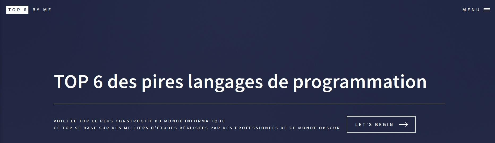

# TOPSIX


## 📋 Description
Ce mini challenge a été développé lors du bootcamp 2022 M1 cybersécurité à Ynov Bordeaux.

## 👥 Auteurs
[BlackCat](https://github.com/Blackcat2710) | [Iamgroottootoo](https://github.com/Iamgroottootoo) | [rthidfrev](https://github.com/rthidfrev) | [charB](https://github.com/RocaFR)

## 💽 Installation
Cloner le repository.
```bash
git clone git@github.com:RocaFR/ynov-bootcamp-tp-vuln-python.git
```
Installer flask.
```bash
python3 -m pip install flask
```
Créer le venv.
```bash
cd ynov-bootcamp-tp-vuln-python
```
```bash
python3 -m venv venv
```

## 🌐 Lancer l'app
**S'assurer d'être dans le dossier racine "ynov-bootcamp-tp-vuln-python".**
```bash
source start_app.sh
```